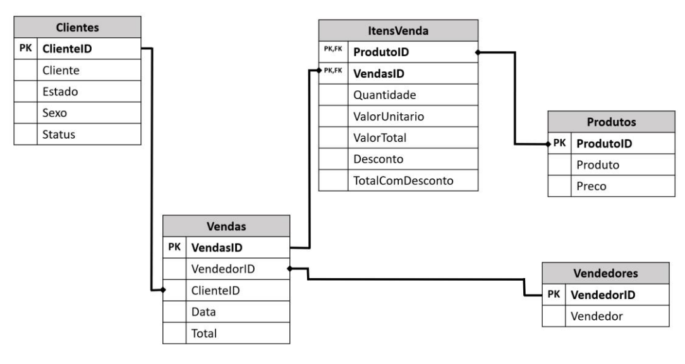

# Spark/PySpark - Atividades com Banco de Dados de Loja do Varejo (Produtos de Ciclismo)

>Resolução de problemas de negócio e soluções de atividades envolvendo banco de dados de uma loja do varejo, considerando um ambiente On-premise e utilização da massa de dados do antigo modulo do curso "Formação Engenharia de Dados [2022]: Domine Big Data! - Udemy"

## Objetivo: 

O presente projeto tem como objetivo simular requisições e problemas de negócios de uma loja do varejo fictícia e apresentar soluções utilizando o PySpark em um ambiente Linux/Ubuntu criado em máquina virtual (VirtualBox).

O esquema do BD Relacional da loja se dá de acordo com a imagem:

<!-- colocar screenshoot do seu projeto -->

## Preparação do ambiente

Para realizar as atividades propostas, utilizou-se da seguinte estrutura:
 
* Criação VM Linux/Ubuntu no Virtual Box;
  P.s.: Por ter alguns problemas de compatibilidade com o Ubuntu 22.04, acabei optando pelo 20.04
* Importação dos arquivos .parquet para a máquina virtual e para o Spark ;
* Resolução das atividades utilizando dataframes;
* Exportação dos dataframes resposta em formato parquet;

## Desafios Propostos: 

### Atividade 1:

* Importar dos dados das tabelas para o pyspark (arquivos parquet);

* Criar consulta que mostre Nome, Estado e Status de cada cliente;

* Criar consulta que mostre apenas os clientes dos status "Platinum" e "Gold";

* Demonstrar o total de vendas agrupado por cada status.

### Atividade 2:

* Criar um banco de dados no DW do Spark nomeado VendasVarejo e persistir todas tabelas no BD;

* Criar consulta que mostre cada item vendido: nome do cliente, data da venda, produto, vendedor e valor total do item.

### Atividade 3:

* Criar uma aplicação Python/Spark que salve uma tabela em um banco de dados PostgreSQL a partir de um arquivo no computador Local, sendo o arquivo podendo ser de diferentes formatos(csv, parquet, etc); informando apenas o formato do arquivo, local do arquivo, nome da tabela a ser salva e banco de dados no PostgreSQL

## Arquivos de resolução

Os arquivos de resolução se encontram anexados e separados por atividade. Consistem em scripts python e arquivos exportados nos formatos parquet,csv,etc.

_______
## Meta

Link do curso: <https://www.udemy.com/course/engenheiro-de-dados/>

Arthur Amaral de Lima --- [Linkedin](https://www.linkedin.com/in/arthuramaral-py/) --- arthur.absens@gmail.com

